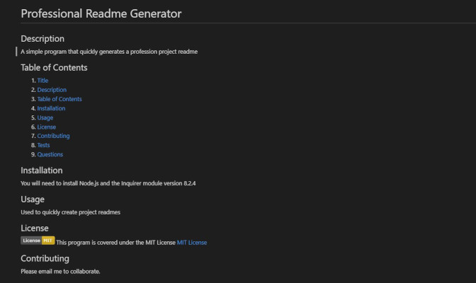

# Professional Readme Generator

## Description

A simple program that quickly generates a profession project readme

## Table of Contents

1. [Title](#project-title)
2. [Description](#description)
3. [Table of Contents](#table-of-contents)
4. [Installation](#installation)
5. [Usage](#usage)
6. [License](#license)
7. [Contributing](#contributing)
8. [Tests](#tests)
9. [Questions](#questions)

## Installation

You will need to install Node.js and the Inquirer module version 8.2.4

## Usage

Used to quickly create project readmes.

Demostration video:

## License

This program is covered under the MIT License:

[MIT License](https://choosealicense.com/licenses/mit/)

## Contributing

Please email me to collaborate.

## Tests

There are no tests for this project at this time.

## Questions

GitHub user: stephen-castillo

Email: stephencastillo117@gmail.com

